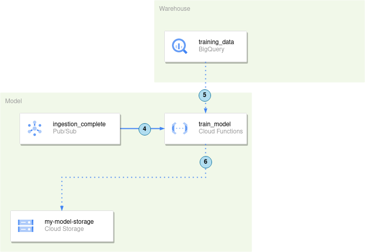
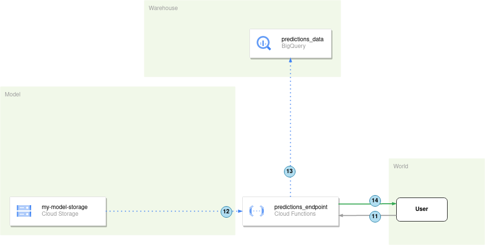

# 7th Academy Pratical Execises

- [7th Academy Pratical Execises](#7th-academy-pratical-execises)
  - [Architecture](#architecture)
    - [Ingestion and training](#ingestion-and-training)
    - [Make the model available](#make-the-model-available)
  - [Create Resources (Tables/Buckets/Topics) within GCP](#create-resources-tablesbucketstopics-within-gcp)
    - [Buckets (UI)](#buckets-ui)
    - [Bigquery Data Sets and Tables (UI)](#bigquery-data-sets-and-tables-ui)
      - [JSON Schema](#json-schema)
    - [Pub/Sub Topics (UI)](#pubsub-topics-ui)
    - [Deploy Cloud Functions (gcloud)](#deploy-cloud-functions-gcloud)
  - [Client Libraries](#client-libraries)
    - [Bigquery Client (Python)](#bigquery-client-python)
    - [Cloud Storage Client (Python)](#cloud-storage-client-python)
    - [Pub/Sub Client (Python)](#pubsub-client-python)
  - [Exercises](#exercises)
    - [0. Meet the data](#0-meet-the-data)
    - [1. Load a file from Cloud Storage to a Bigquery Table using a Cloud Function.](#1-load-a-file-from-cloud-storage-to-a-bigquery-table-using-a-cloud-function)
    - [2. Deploy a Cloud function that trains a model and saves it in GCS.](#2-deploy-a-cloud-function-that-trains-a-model-and-saves-it-in-gcs)
    - [3. Create an endpoint to serve the model to the outside world.](#3-create-an-endpoint-to-serve-the-model-to-the-outside-world)
    - [4. (Extra) Retraining the model.](#4-extra-retraining-the-model)


## Architecture

We are going to build a simple *MLOps* architecture in *Google Cloud Platform* using
`Cloud Storage`, `Cloud Functions`, `Bigquery` and `Pubsub`.

Our minimal *MLOps* system should look like this in the end:


### Ingestion and training

1. Cloud Function `ingest_data` monitors the `my-data-landing-zone` for new files.
2. Upon detecting a new file, `ingest_data` writes its contents to the BigQuery table `training_data`.
3. A message is sent to the `ingestion_complete` topic, notifying subscribers about the new data in BigQuery.
4. The `train_model` Cloud Function, subscribed to `ingestion_complete`, is triggered and begins training.
5. It retrieves data from the `training_data` BigQuery table.
6. The trained model is saved in the `my-model-storage` bucket.

### Make the model available

11. The `predictions_endpoint` Cloud Function receives a request containing new data from a client.
12. The Function loads the previously stored model into memory.
13. It makes a prediction and stores the prediction and new data in the `predictions_data` BigQuery table.
14. The prediction result is returned to the client.

## Create Resources (Tables/Buckets/Topics) within GCP

### Buckets (UI)

> ####  What is Google Cloud Storage (GCS)? 
> 
> Google Cloud Storage (GCS) is a scalable, fully-managed, and highly available object storage service provided by Google Cloud Platform. It allows users to store, access, and manage data across multiple storage classes, catering to various use cases like backup, archival, and content delivery. GCS ensures data durability and offers seamless integration with other Google Cloud services.

1. Search for the Cloud Storage in the Search bar.

    

2. In the Cloud Storage UI, you'll notice there are no buckets created yet. To create one, click the `CREATE` button.

    

3. Configurate your bucket

    

    1. Name your bucket and click Continue.
    2. Change the storage class from Multi-region to Region. Set the location to europe-west3, as shown in the image, and click Continue.
    3. Keep the remaining settings as they are.
    4. Click create.

    Your configuration should look like this:

    

    If this popup appears, leave the settings as they are.

    


And now you have your bucket!


Alternatively, you can create a bucket using [Python](https://cloud.google.com/storage/docs/creating-buckets#storage-create-bucket-python), other Client Libraries, or even advanced Infrastructure-as-Code tools like [Terraform](https://cloud.google.com/storage/docs/creating-buckets#storage-create-bucket-terraform) or [Pulumi](https://www.pulumi.com/registry/packages/gcp/api-docs/storage/bucket/).


### Bigquery Data Sets and Tables (UI)


> #### What is Bigquery? 
> 
> BigQuery is a fully-managed, serverless, petabyte-scale data warehouse by Google Cloud Platform. It enables super-fast SQL queries using the processing power of Google's infrastructure, allowing users to analyze large datasets in real-time. BigQuery is designed for scalability, ease of use, and integration with other Google Cloud services.


Tables are always associated with a `data set`. First, let's create a `data set`.

1. Go to BigQuery:

   

2. Click the bullet points icon next to the project name:

   

3. Name your data set, change the region, and click `CREATE DATA SET`:

   

    Congratulations! You have a `data set`!

    Now, let's create a table:

4. Click the bullets icon next to your data set, and click *Create Table*:

   

5. Configure your table settings:

   

    Alternatively, you can define the schema using `JSON`:

    

And now you have a table too!

Remember the location of the <u>**Table ID**</u>; you might need it later:


Learn more about tables in the [documentation](https://cloud.google.com/bigquery/docs/tables).

You can also create Tables with Infrastructure-As-Code tools. Here are the examples for [Terraform](https://registry.terraform.io/providers/hashicorp/google/latest/docs/resources/bigquery_table) and for the several [Clients for Pulumi](https://www.pulumi.com/registry/packages/gcp/api-docs/bigquery/table/)

#### JSON Schema

> Why should you use JSON schemas when possible?
>
> 1. Structure and consistency: JSON schemas define the structure of your data, ensuring consistency across all records in the table. This helps maintain data integrity and makes it easier to query and analyze the data.
> 
> 2. Validation: By specifying a schema, you can enforce data validation rules, such as data types and required fields, ensuring that only valid data is inserted into the table. This can prevent issues caused by incorrect or incomplete data.
> 
> 3. Readability: JSON schemas provide a clear and human-readable description of the table's structure, making it easier for team members to understand the data and its organization
> 
> 4. Interoperability: JSON schemas are a standardized format, which makes it simpler to share and exchange table structures across teams and different systems. This is particularly useful when integrating with other tools or platforms that support JSON schema.
> 
> 5. Easier data import: When importing data from files (e.g., CSV or JSON) into BigQuery, providing a JSON schema allows BigQuery to map the file's data correctly to the table's columns, preventing import errors and ensuring data consistency.

Here's an example of a JSON schema:

```json
[
    {
        "name": "my_required_text_field",
        "type": "STRING",
        "mode": "REQUIRED",
        "description": "A text field"
    },
    {
        "name": "my_required_integer_field",
        "type": "INTEGER",
        "mode": "NULLABLE",
        "description": "An integer field"
    },
    {
        "name": "my_nullable_boolean_field",
        "type": "BOOLEAN",
        "mode": "NULLABLE",
        "description": "A boolean field"
    }
]
```

You can also find it in the folder `./infrastructure/bigquery/example_schema.json`.

You can fiend more about how to define JSON schemas in the [Google Documentation](https://cloud.google.com/bigquery/docs/schemas#specifying_a_json_schema_file).

-----
### Pub/Sub Topics (UI)

> #### What is the Publisher-Subscriber pattern?
>
>       The publisher-subscriber (pub-sub) messaging pattern is a communication paradigm where messages are sent by publishers to multiple subscribers, without requiring direct connections between them. Publishers broadcast messages to topics, and subscribers listen to topics they are interested in. This pattern provides a decoupled architecture, allowing for scalability, flexibility, and fault tolerance. Subscribers receive messages asynchronously, enabling them to process events independently, without blocking or waiting for other subscribers. The pub-sub pattern is widely used in distributed systems, event-driven architectures, and messaging applications.
>
> #### What is Google Pub/Sub?
>
>       Google Pub/Sub is a real-time messaging service based on the publisher-subscriber pattern, designed for Google Cloud Platform. It enables reliable, scalable, and asynchronous event-driven communication between microservices, applications, and data streams, promoting decoupled and flexible architectures.

1. Search for *Topics* in the search bar.
2. Click in **CREATE TOPIC**.

    

3. Define your Topic ID and click **CREATE**
   
    

    In this case, our Topic ID is `ingestion_complete`.
    
    Remember where to find your Topic IDs, it will be useful when instrumenting the python scripts.

4. We have a new topic!
   
   

   It automatically creates a subscription, but lets ignore that for now.

5. If you go back to the Topics page, it should look like this

    

Like any other resource, we can also create Topics and Subscriptions with IaC.

Follow these links for examples for [Terraform](https://registry.terraform.io/providers/hashicorp/google/latest/docs/resources/pubsub_subscription) and [Pulumi](https://www.pulumi.com/registry/packages/gcp/api-docs/pubsub/subscription/).

### Deploy Cloud Functions (gcloud)

In the exercises we will deploy Cloud Functions from a Zip file. For this, we need a bucket specifically for storing the zipped code of the functions. [Find more information on GCP documentation](https://cloud.google.com/functions/docs/deploy#from-cloud-storage), and follow the example in [how to create a bucket](#buckets-ui) to create a bucket for the zipped files.

1. Activate the Cloud Shell

    

    After a while, you should have a command line in the bottom of your browser. Confirm that you have an active project (green rectangle). If not, contact us.

    

2. Execute the following command:

    ```bash
    gcloud functions deploy [YOUR_FUNCTION_NAME] \
        --region=europe-west3 \
        --runtime=python39 \
        --source=gs://[ZIPPED_FUNCTIONS_BUCKET]/[ZIP_NAME] \
        --entry-point=main \
        TRIGGER_FLAGS
    ```


    `--region`: Deployment Region.
    - [List of Regions](https://cloud.google.com/functions/docs/locations)

    `--runtime`: The execution environment.
    - [Available environments](https://cloud.google.com/functions/docs/concepts/execution-environment) (We will use python39)
        
    `--source`: Source code of the function.
    - There are several ways to access the source code. We will use [Deploy from Cloud Storage](https://cloud.google.com/functions/docs/deploy#from-cloud-storage). But you can deploy from a source repository or directly from a local machine (your PC).

    `--entry-point`: The *function/code* executed when the **Cloud Function** runs.
    - Learn more here for [event-driven functions](https://cloud.google.com/functions/docs/writing/write-event-driven-functions#background-functions) and for [http functions](https://cloud.google.com/functions/docs/writing/write-http-functions#implementation).

    `TRIGGER_FLAGS`: The trigger type of the Cloud Function.
    - See more in the [table here](https://cloud.google.com/functions/docs/deploy#basics).
    - In our case, we will use three trigger types for the three cloud functions. `--trigger-bucket`, `--trigger-topic` and `--trigger-http`.

    If this shows up:

    

    Type `y`

3. Check the status of your deployment.
   
    Search for Cloud Build

    

    And check if you are in Region europe-west3. Something similar to this should show up:

    

    If the cloud function was deployed with success, you'll get a green check

    

    Go to the Cloud Functions UI, and check that your function was deployed with success.

    

    You can click the function name and check it's properties, configurations and even source code deployed.

    For example, we can check if the trigger of a cloud function in the `Trigger` page.

    

    If your deployment didn't work, let us know and we'll help you.

## Client Libraries

A client implementation, such as a Python Client or Javascript Client, is a software library designed to facilitate communication and interaction between an application and a specific service, like an API. It allows developers to easily access and utilize the service's functionalities, by abstracting low-level details and providing a more user-friendly interface in the language of choice.

The client implementation acts as an API layer between the application and the server, enabling seamless data exchange and requests management. This layer simplifies the process of making API calls, handling authentication, managing connection details, and processing responses from the server.

For example, the Google Cloud Platform (GCP) offers BigQuery Python Client and Python Cloud Storage as part of their Cloud Client Libraries. These libraries provide high-level API abstractions that significantly reduce the amount of boilerplate code developers need to write when interacting with BigQuery and Cloud Storage services.

Using the GCP BigQuery Python Client, developers can easily query, manage, and load data into BigQuery tables, while the Python Cloud Storage library simplifies file management, uploads, and downloads in Google Cloud Storage. Both libraries embrace the idiomatic style of the Python language, ensuring better integration with the standard library and developers' existing codebases.

You can check all the available Client Libraries for python [here](https://cloud.google.com/python/docs/reference).

### Bigquery Client (Python)

You can use the BigQuery Python Client to execute a query and fetch the results:

```python
# NOTE: pip install google-cloud-bigquery

from google.cloud import bigquery

# Initialize the BigQuery client
client = bigquery.Client()

# Define your query
query = """
    SELECT name, SUM(number) as total
    FROM `bigquery-public-data.usa_names.usa_1910_current`
    WHERE year >= 2000
    GROUP BY name
    ORDER BY total DESC
    LIMIT 10
"""

# Execute the query
query_job = client.query(query)

# Fetch and print the results
for row in query_job.result():
    print(f"{row.name}: {row.total}")
```

### Cloud Storage Client (Python)

You can use the Python Cloud Storage Client to upload a file to a GCS bucket and download it back:

```python
# NOTE: pip install google-cloud-storage

from google.cloud import storage

# Initialize the GCS client
client = storage.Client()

# Specify your bucket name
bucket_name = "your-bucket-name"

# Get a reference to the bucket
bucket = client.get_bucket(bucket_name)

# Upload a file
source_file_name = "path/to/your/local/file.txt"
destination_blob_name = "uploaded_file.txt"
blob = bucket.blob(destination_blob_name)
blob.upload_from_filename(source_file_name)
print(f"File {source_file_name} uploaded to {destination_blob_name}.")

# Download the file
downloaded_file_name = "path/to/your/local/downloaded_file.txt"
blob = bucket.blob(destination_blob_name)
blob.download_to_filename(downloaded_file_name)
print(f"File {destination_blob_name} downloaded to {downloaded_file_name}.")
```


### Pub/Sub Client (Python)

You can use the Pub/Sub Python Client to publish a message to the existing topic:

```python
# NOTE: pip install google-cloud-pubsub

from google.cloud import pubsub_v1

# Initialize the Pub/Sub client
publisher = pubsub_v1.PublisherClient()

# Set your project_id and topic_name
project_id = "your-project-id"
topic_name = "your-existing-topic-name"

# Get the topic path
topic_path = publisher.topic_path(project_id, topic_name)

# Publish a message
message = "Hello, World!"
message_data = message.encode("utf-8")
future = publisher.publish(topic_path, message_data)
message_id = future.result()
print(f"Message published with ID: {message_id}")
```

As Pub/Sub promotes decoupled and flexible architectures, message_data is transformed into a [base64-encoded string](https://cloud.google.com/pubsub/docs/reference/rest/v1/PubsubMessage) to ensure language-agnostic compatibility. Therefore, subscribers must decode the base64 message. In Python, this can be done as follows:

```python
import base64

def hello_pubsub(data, context):
    """Triggered from a message on a Cloud Pub/Sub topic.
    Args:
         event (dict): Event payload.
         context (google.cloud.functions.Context): Metadata for the event.
    """
    print("This Function was triggered by messageId {} published at {}".format(context.event_id, context.timestamp))

    if 'data' in event:
        decoded_msg = base64.b64decode(data['data']).decode('utf-8')
        # Message is now decoded
    ## Your Cloud Function Implementation
```

## Exercises

If you are having troubles advancing in the exercices, please don't hesitate in contacting us.

### 0. Meet the data

We will use the [Titanic Dataset](https://github.com/datasciencedojo/datasets/blob/master/titanic.csv) available pretty much anywhere.

The columns and their types are the following

| Column name    | Python data type | Bigquery data type | Description                                               |
|----------------|------------------|--------------------|-----------------------------------------------------------|
| PassengerId    | int              | INT64             | Unique identifier for each passenger                      |
| Survived       | int              | INT64             | Survival status (0 = No, 1 = Yes)                         |
| Pclass         | int              | INT64             | Ticket class (1 = 1st, 2 = 2nd, 3 = 3rd)                  |
| Name           | str              | STRING            | Full name of the passenger                                |
| Sex            | str              | STRING            | Gender (male or female)                                   |
| Age            | float            | FLOAT64           | Age in years                                              |
| SibSp          | int              | INT64             | Number of siblings/spouses aboard the Titanic             |
| Parch          | int              | INT64             | Number of parents/children aboard the Titanic             |
| Ticket         | str              | STRING            | Ticket number                                             |
| Fare           | float            | FLOAT64           | Passenger fare                                            |
| Cabin          | str              | STRING            | Cabin number                                              |
| Embarked       | str              | STRING            | Port of embarkation (C = Cherbourg, Q = Queenstown, S = Southampton) |


So, when creating the Tables, you have to create the schema accodingly. 

The dataset is available at `./dataset/titanic.csv`.


As a final note, install a virtual environment with the following command:

```python
python -m venv venv
```

Install the Python Extension:

)

With VSCode, do `CTRL+SHIFT+P` and write `Select Interpreter`


And find the `venv` python executable.


### 1. Load a file from Cloud Storage to a Bigquery Table using a Cloud Function.


In this exercise, we will create the `ingest_data` Cloud Function, that will perform the following tasks:

1. The `ingest_data` function will actively monitor the `my-data-landing-zone` Google Cloud Storage bucket for new files. This is achieved by configuring a trigger in the Cloud Function to listen for object creation events in the specified bucket.

2. When a new file is detected, the `ingest_data` function will read the contents of the file and write the data into a BigQuery table named `training_data`. The function will leverage the BigQuery Python client library to facilitate this process, efficiently importing the data from the file into the specified table.

3. After successfully importing the data into BigQuery, the `ingest_data` function will send a message to the `ingestion_complete` topic in Google Cloud Pub/Sub. This message will notify all subscribers that new data has been loaded into BigQuery, allowing them to react accordingly, such as by initiating further data processing tasks.

The Cloud Function `ingest_data` will utilize the Google Cloud Storage, BigQuery, and Pub/Sub client libraries for these tasks. Our goal in this exercise is to develop the code for this function and deploy it to Google Cloud Platform.


- You can adapt the function to create flags/categories for TRAIN/TEST/VALIDATION at runtime, assuming your table was created with that field.


The outline of the *Cloud Function* code is available at `./functions/ingest_data/`


Deployment:

```bash
gcloud functions deploy YOUR_FUNCTION_NAME \
    --region=europe-west3 \
    --runtime=python39 \
    --source=?? \
    --entry-point=main \
    --trigger-??
```

### 2. Deploy a Cloud function that trains a model and saves it in GCS.



In this exercise, we will create a Cloud Function called `train_model`, which will be responsible for training a machine learning model using the data ingested in the previous steps. The function will be triggered by the `ingestion_complete` Pub/Sub topic, ensuring it starts training once new data is available in the BigQuery table. The steps involved in this process are as follows:

4. The `train_model` Cloud Function is subscribed to the `ingestion_complete` topic, and it will be triggered automatically when a new message is published, indicating that new data has been loaded into the BigQuery table.

5. Upon being triggered, the `train_model` function retrieves the data from the `training_data` BigQuery table using the appropriate query. This data will be used to train a machine learning model, such as a Scikit-learn Random Forest or Logistic Regression model.

6. After the model is trained using the fetched data, the `train_model` function saves the trained model to the `my-model-storage` Google Cloud Storage bucket. The user implementing this function can choose the preferred naming convention for the saved model.

This exercise will guide you through the process of developing the `train_model` Cloud Function, which leverages the power of BigQuery, Scikit-learn, and Google Cloud Storage to create, train, and store a machine learning model.

The outline of the *Cloud Function* code is available at `./functions/train_model/`

Deployment:

```bash
gcloud functions deploy YOUR_FUNCTION_NAME \
    --region=europe-west3 \
    --runtime=python39 \
    --source=?? \
    --entry-point=main \
    --trigger-??
    --memory=512MB
```

### 3. Create an endpoint to serve the model to the outside world.



In this exercise, you'll be working with the `predictions_endpoint` Cloud Function. This HTTP-triggered function serves as the prediction endpoint for clients to send new data points. Upon receiving a request containing new data, the function performs the following steps:

1. It loads the previously trained model from the `my-model-storage` bucket into memory.
2. Utilizing the loaded model, it generates a prediction based on the new data point received in the request.
3. The function then stores both the prediction and the new data in the `predictions_data` BigQuery table to maintain a record of all predictions.
4. Finally, it returns the prediction result to the client, completing the request-response cycle.

Your task is to develop the code for the `predictions_endpoint` Cloud Function and deploy it, ensuring that it can efficiently handle the entire process from receiving new data to returning predictions.


Deployment:

```bash
gcloud functions deploy YOUR_FUNCTION_NAME \
    --region=europe-west3 \
    --runtime=python39 \
    --source=?? \
    --memory=512MB \
    --entry-point=predict \
    --trigger-?? \
    --allow-unauthenticated
```


You can make requests with a cURL comamnd like so:

```bash
curl -X POST -H "Content-Type: application/json" -d '{"Pclass": 3, "Name": "Some Name", "Sex": "male", "Age": 22, "SibSp": 1, "Parch": 0, "Ticket": "A/5 21171", "Fare": 7.25, "Cabin": "", "Embarked": "S"}' http://YOUR_FUNCTION_ENDPOINT
```

or by going to the app [on Stackblitz](https://stackblitz.com/edit/closer-gcp-titanic-frontend-example?file=src%2Fapp%2Ftitanic-prediction.service.ts) and change the `TitanicEndpoint` variable in `./src/app/titanic-prediction.service.ts`.

### 4. (Extra) Retraining the model.

In this final exercise, you'll focus on extending an existing diagram to include the model retraining cycle. Using a diagramming tool like draw.io or Excalidraw, you will visually represent how the retraining cycle integrates into the current architecture. The diagram should include the following element:

- Incorporate the model retraining cycle into the architecture. Show how the system monitors prediction performance, triggers model retraining when necessary, and updates the stored model in the my-model-storage bucket. You may also want to include a mechanism for evaluating the new model's performance and deciding whether to replace the existing model or keep it.

Your task is to design a clear and informative diagram that visually communicates how the model retraining cycle interacts with the existing architecture, helping others better understand the complete system.