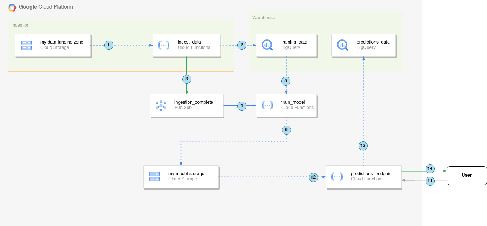

# 7th Academy Pratical Execises

- [7th Academy Pratical Execises](#7th-academy-pratical-execises)
  - [Architecture](#architecture)
    - [Ingestion and training](#ingestion-and-training)
    - [Make the model available](#make-the-model-available)
  - [Exercises](#exercises)
    - [0. Meet the data](#0-meet-the-data)


## Architecture

We are going to build a simple *MLOps* architecture in *Google Cloud Platform* using
`Cloud Storage`, `Cloud Functions`, `Bigquery` and `Pubsub`.

Our minimal *MLOps* system should look like this in the end:



### Ingestion and training

1. Cloud Function `ingest_data` monitors the `my-data-landing-zone` for new files.
2. Upon detecting a new file, `ingest_data` writes its contents to the BigQuery table `training_data`.
3. A message is sent to the `ingestion_complete` topic, notifying subscribers about the new data in BigQuery.
4. The `train_model` Cloud Function, subscribed to `ingestion_complete`, is triggered and begins training.
5. It retrieves data from the `training_data` BigQuery table.
6. The trained model is saved in the `my-model-storage` bucket.

### Make the model available

11. The `predictions_endpoint` Cloud Function receives a request containing new data from a client.
12. The Function loads the previously stored model into memory.
13. It makes a prediction and stores the prediction and new data in the `predictions_data` BigQuery table.
14. The prediction result is returned to the client.


## Exercises

If you are having troubles advancing in the exercices, please don't hesitate in contacting us.

### 0. Meet the data

We will use the [Titanic Dataset](https://github.com/datasciencedojo/datasets/blob/master/titanic.csv) available pretty much anywhere.

The columns and their types are the following

| Column name    | Python data type | Bigquery data type | Description                                               |
|----------------|------------------|--------------------|-----------------------------------------------------------|
| PassengerId    | int              | INT64             | Unique identifier for each passenger                      |
| Survived       | int              | INT64             | Survival status (0 = No, 1 = Yes)                         |
| Pclass         | int              | INT64             | Ticket class (1 = 1st, 2 = 2nd, 3 = 3rd)                  |
| Name           | str              | STRING            | Full name of the passenger                                |
| Sex            | str              | STRING            | Gender (male or female)                                   |
| Age            | float            | FLOAT64           | Age in years                                              |
| SibSp          | int              | INT64             | Number of siblings/spouses aboard the Titanic             |
| Parch          | int              | INT64             | Number of parents/children aboard the Titanic             |
| Ticket         | str              | STRING            | Ticket number                                             |
| Fare           | float            | FLOAT64           | Passenger fare                                            |
| Cabin          | str              | STRING            | Cabin number                                              |
| Embarked       | str              | STRING            | Port of embarkation (C = Cherbourg, Q = Queenstown, S = Southampton) |


So, when creating the Tables, you have to create the schema accodingly. 

The dataset is available at `./dataset/titanic.csv`.


As a final note, install a virtual environment with the following command:

```python
python -m venv venv
```

Install the Python Extension:


With VSCode, do `CTRL+SHIFT+P` and write `Select Interpreter`


And find the `venv` python executable.

