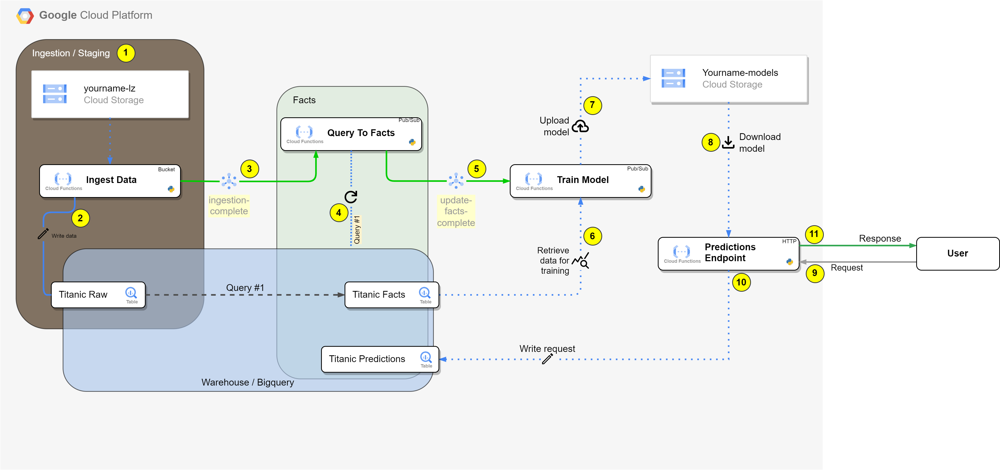

# Architecure

We are going to build a simple *MLOps* project in *Google Cloud Platform* using
`Cloud Storage`, `Cloud Functions`, `Bigquery` and `Pubsub`.

Our minimal *MLOps* system should look like this in the end:

## 1. Ingestion

1. Cloud Function `Ingest Data` monitors the `yourname-lz` for new files.
2. Upon detecting a new file, `Ingest Data` writes its contents to the BigQuery table `Titanic Raw`.
3. Once sucessufully complete, a message is sent to the `yourname-ingestion-complete` topic, notifying subscribers about the new data in BigQuery.

## 2. Staging to Facts

4. The function `Query to Facts` is activated, and executes a query which moves new data from the `Titanic Raw` *table* to `Titanic Facts`.
5. Once sucessfully complete, a message is sent to the topic `yourname-update-facts-complete`, notifying its subscribers that the move from raw to facts is complete.

## 3. Train model

6. The `train_model` Cloud Function, is activated by the topic`yourname-update-facts-complete`, and pulls the data from the bigquery table `Titanic Facts`.
7. Once the training of the model is done, the model file is uplodaded to the `yourname-models` bucket.

## 4. Predictions

8. A model is retrieved from the  `yourname-models` bucket and lodaded into the Cloud Function. The function is ready to take requests.
9. A request for a prediction is made by an user.
10. The request is saved to the `Titanic Predictions` table
11. A response is given back to the user.
