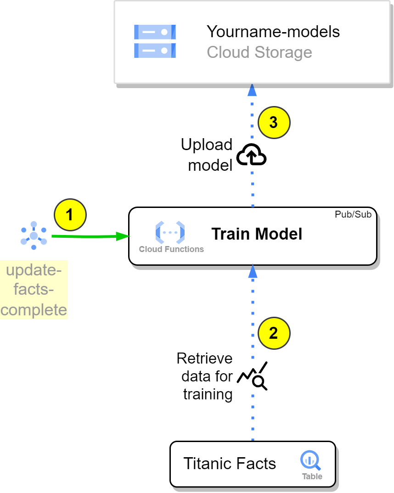

# Deploy a Cloud function that trains a model and saves it in GCS

- [Deploy a Cloud function that trains a model and saves it in GCS](#deploy-a-cloud-function-that-trains-a-model-and-saves-it-in-gcs)
  - [Introduction](#introduction)
  - [Tasks](#tasks)
  - [Create the Google Cloud Resources](#create-the-google-cloud-resources)
    - [1. Create the models GCS Bucket](#1-create-the-models-gcs-bucket)
  - [Update the Cloud Function Code](#update-the-cloud-function-code)
  - [Documentation](#documentation)

## Introduction



In this exercise, we will create a Cloud Function called `Train Model`, which will be responsible for training a machine learning model using the data ingested in the previous steps. The function will be triggered by the `ingestion_complete` Pub/Sub topic, ensuring it starts training once new data is available in the BigQuery table. The steps involved in this process are as follows:

1. The `Train Model` Cloud Function is subscribed to the `[yourname]-update-facts-complete` topic, and it will be triggered automatically when a new message is published, indicating that new data has been loaded into the BigQuery table.

2. Upon being triggered, the `train_model` function retrieves the data from the `Titanic Facts` BigQuery table using the appropriate query. This data will be used to train a machine learning model, such as a Scikit-learn Random Forest or Logistic Regression model.

3. After the model is trained using the fetched data, the `Train Model` function saves the trained model to the `[yourname]-models` Google Cloud Storage bucket. You can choose the name for this model, but it should be unique.

This exercise will guide you through the process of developing the `train_model` Cloud Function, which leverages the power of BigQuery, Scikit-learn, and Google Cloud Storage to create, train, and store a machine learning model.

For this you will need these resources:

- The already created *Data Set* in step 1.
- The already created *Bigquery Table* in step 2.
- The already created *Pub/Sub Topic* in step 2.
- One GCS Bucket named `[prefix]-models` where you will save the model

The outline of the *Cloud Function* code is available at `./functions/manual_exercises/c_train_model/app`

```text
c_train_model/
├── app/
│   ├── funcs/
│   │   ├── models.py # Models to make typechecking easier.
│   │   ├── gcp_apis.py # Functions to call google services.
│   │   ├── common.py # Common functions (Utils).
|   |   └── train_model.py # Train model functions
│   ├── main.py # Main module and entry point for the Cloud Function
│   └── requirements.txt # Requirements for the function execution.
├── config/
│   └── dev.env.yaml # Environment variables that will ship with the function deployment
└── tests/
    └── test_*.py # Unit tests.
```

## Tasks

- [ ] Create the Google Cloud Resources
- [ ] Update the Cloud Function Code
- [ ] Test the Cloud Function
- [ ] Deploy the Cloud Function

## Create the Google Cloud Resources

Here are the resources necessary to complete the exercise:

You can create the resources with Cloud Shell or in the Console.
***The end result will be the same. When creating a resource, choose either to create it with the cloud shell or the console, but not both.***

For Cloud Shell, set these variables:

```bash
export PROJECT_NAME=$(gcloud config get-value project)
export REGION=europe-west3
export YOURNAME=your_name_in_lowercase
```


### 1. Create the models GCS Bucket

```bash
gsutil mb \
    -p ${PROJECT_ID} \
    -c regional \
    -l ${REGION} \
    gs://${YOURNAME}-models

gsutil label ch -l owner:${YOURNAME} gs://${YOURNAME}-models
gsutil label ch -l project:${PROJECT_NAME} gs://${YOURNAME}-models
gsutil label ch -l purpose:academy gs://${YOURNAME}-models
```

Reference: [gsutil mb](https://cloud.google.com/storage/docs/gsutil/commands/mb), [gsutil label](https://cloud.google.com/storage/docs/gsutil/commands/label)

With the console:

Same as in step 1, but now the bucket name is `[yourname]-models`

## Update the Cloud Function Code

1. Decode Base64 Message: Add code to decode the base64 message.

```python
# IMPLEMENTATION [1]: Add code to decode the base64 message.
```

2. Create Clients: Use the Google Cloud Storage API and BigQuery API to create respective client objects.

```python
# IMPLEMENTATION [1]: Use the storage API to make a Client Object
# IMPLEMENTATION [2]: Use the bigquery API to make a Client Object
```

3. Create SQL Query: Create an SQL query to retrieve data from the BigQuery table with Titanic data.

```python
# IMPLEMENTATION [3]: Create an SQL query to retrieve data from the bigquery table with Titanic data.
```

4. Set Bucket Name: Add your GCS bucket name to store the trained model.

```python
# IMPLEMENTATION [4]: Add your prefix-bucket-models here.
```

5. Set Model Name: Give a name to your trained model.

```python
# IMPLEMENTATION [5]: Give a name to your model.
```

6. Connect to Bucket: Connect to the GCS bucket using the correct method for the Storage Client.

```python
# IMPLEMENTATION [6]: Connect to the bucket in [4] using the correct method
```

7. Connect to Blob: Connect to the blob (file object) inside the bucket, using the bucket object.

```python
# IMPLEMENTATION [7]: Connect to the blob(file object) inside the bucket, using the `bucket` object.
```

8. (Optional) Remove Columns: Remove any additional columns that shouldn't be passed to the model.

```python
# OPTIONAL [1]: Add 'set_type' or other columns that shouldn't be passed to the model.
```

Remember to remove the pass statement after implementing the first step (Decoding Base64 Message).

Deployment:

```bash
gcloud beta functions deploy jm_test_train_model \
    --gen2 --cpu=1 --memory=512MB \
    --region=europe-west3 \
    --runtime=python311 \
    --source=functions/simple_mlops/c_train_model/app/ \
    --env-vars-file=functions/simple_mlops/c_train_model/config/dev.env.yaml \
    --entry-point=main \
    --trigger-topic=your_name_in_lowercase-update-facts-complete
```

## Documentation

::: simple_mlops.c_train_model.app.main

::: simple_mlops.c_train_model.app.funcs.train_models

::: simple_mlops.c_train_model.app.funcs.common

::: simple_mlops.c_train_model.app.funcs.gcp_apis

::: simple_mlops.c_train_model.app.funcs.models
